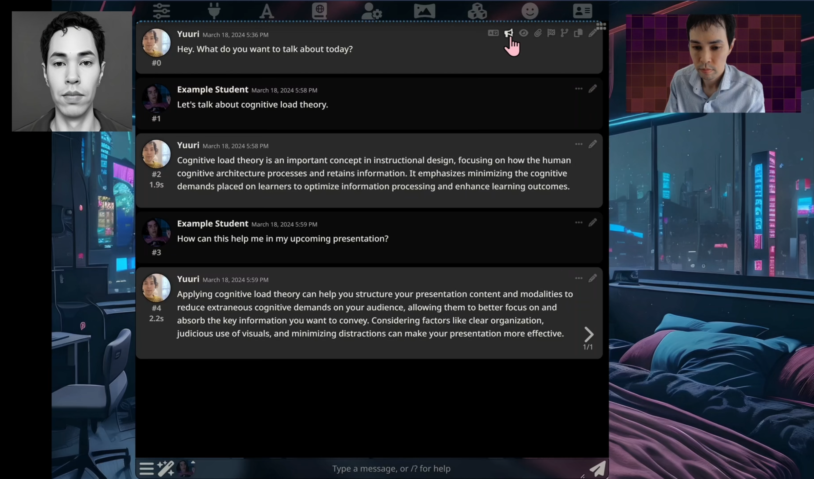

**Silly Tavern demonstration – Persona/Voice clone**

Posted on March 19, 2024

This is a technology demonstration (many local servers + external APIs) of using Silly Tavern UI to chat with a character designed after myself called “Yuuri” (two “u” to distinguish from myself “Yuri”).

I have questions on the possibilities for cognitive science and psychology research. Potential areas to explore include the impact on self-perception, learning and retention, confidence and self-efficacy, therapy and mental health applications, and advancements in human-computer interaction.

These are just ideas and speculations.

This project brings together many technologies: SillyTavern, XTTS API server, SillyTavern-Extras server, OpenAI Whisper, and Claude 3 Haiku, connected through multiple servers and environments

- SillyTavern: [https://github.com/SillyTavern](https://github.com/SillyTavern)
- XTTS API server: [https://github.com/daswer123/xtts-api-server](https://github.com/daswer123/xtts-api-server)
- SillyTavern-Extras server: [https://github.com/SillyTavern/SillyTavern-Extras](https://github.com/SillyTavern/SillyTavern-Extras)
- OpenAI Whisper: [https://openai.com/research/whisper](https://openai.com/research/whisper)
- Claude 3 Haiku: [https://docs.anthropic.com/claude/docs/models-overview](https://docs.anthropic.com/claude/docs/models-overview)
- OpenRouter.ai: [https://openrouter.ai/](https://openrouter.ai/)
- SerpaAPI: [https://serpapi.com/](https://serpapi.com/)

Please see my demonstration video:

